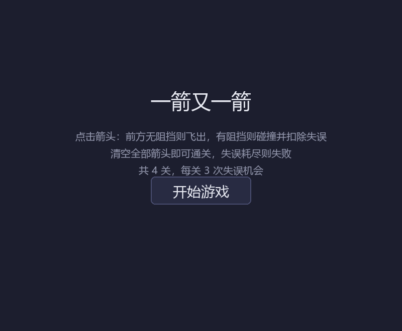
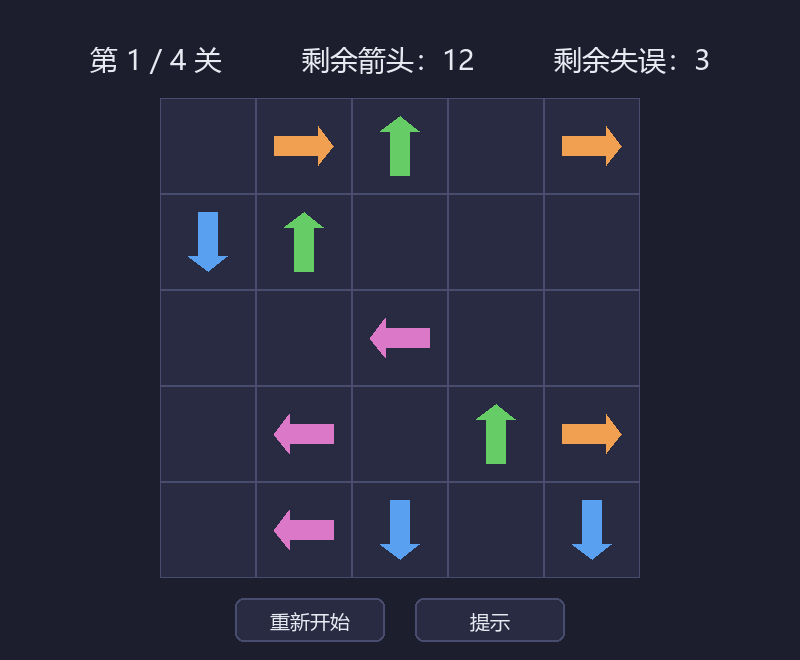
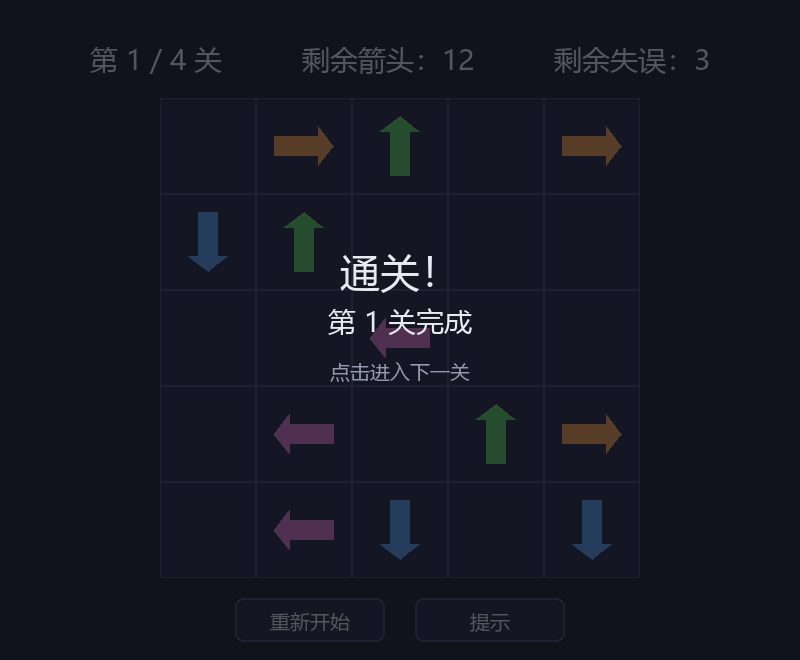
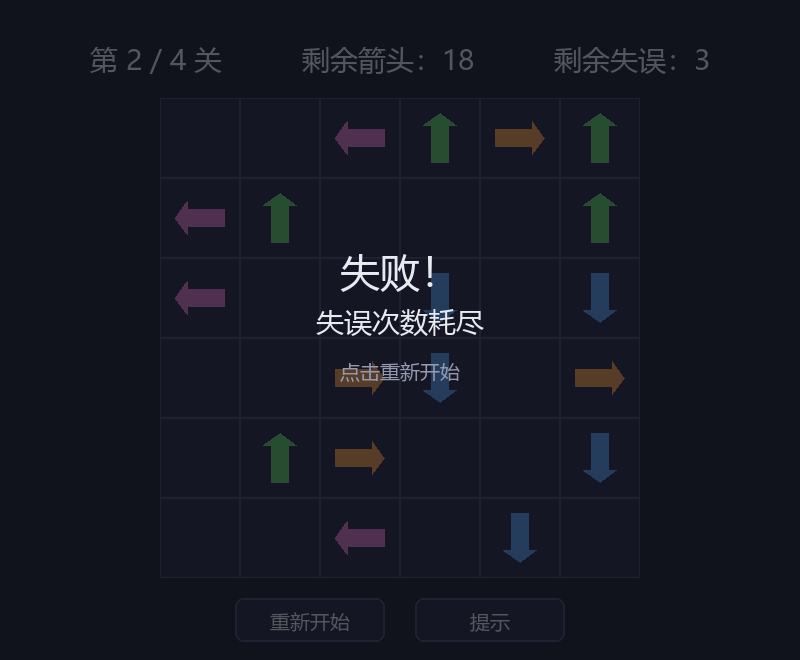

# 一箭又一箭（Arrow by Arrow）

一个点击式箭头解谜小游戏。福州大学《软件工程》课程第二次个人作业，使用 Python + AIGC（Claude Code）开发。

## 游戏简介

棋盘中分布着若干带方向的箭头（上、下、左、右）。点击箭头时：

- 若箭头**前进方向**到棋盘边界之间**没有其他箭头阻挡**，箭头飞出棋盘并被消除；
- 若**有箭头阻挡**，则发生碰撞，箭头晃动变红，并消耗一次失误机会。

消除本关全部箭头即可进入下一关；失误次数耗尽则本关失败，可重新开始。共 4 个关卡，难度递进。

## 开发环境

- 操作系统：Windows 11
- Python 3.12
- Pygame 2.6.1
- AIGC 工具：Claude Code（Anthropic）

## 安装和运行方法

```bash
# 1. 安装依赖
pip install -r requirements.txt

# 2. 运行游戏
python main.py
```

## 游戏操作说明

| 操作 | 说明 |
| ---- | ---- |
| 鼠标左键点击箭头 | 尝试消除该箭头（前方无阻挡则飞出，有阻挡则碰撞扣失误） |
| 「重新开始」按钮 | 将当前关卡恢复到初始状态 |
| 「提示」按钮 | 高亮显示一个当前可消除的箭头 |
| 点击「开始游戏」 | 从第 1 关开始 |
| 通关/失败界面点击 | 进入下一关 / 重新开始 |

每关有 3 次失误机会。界面顶部实时显示：当前关卡、剩余箭头数量、剩余失误次数。

## 游戏截图

开始界面：



游戏界面：



通关界面：



失败界面：



## 项目结构

```
arrow_game/
├── main.py            # 游戏主程序（逻辑 + 渲染 + 主循环）
├── test_game.py       # 核心逻辑自动化测试
├── requirements.txt   # 依赖清单
├── README.md          # 本文件
└── screenshots/       # 界面截图
```

## 测试

运行核心逻辑测试：

```bash
python test_game.py
```

覆盖路径检测、消除计数、四方向判断，以及全部 4 个关卡的可通关性验证（每个关卡都能找到完整且合法的消除顺序）。
